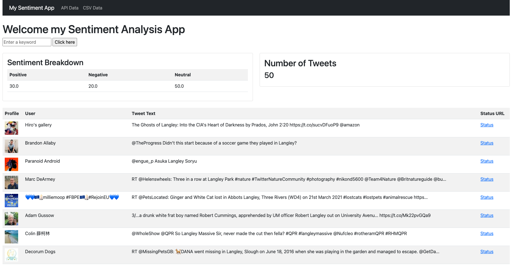

# Final - Sentiment Analysis Project

Here are the following steps to complete to finish off your Sentiment Analysis Project!! Woohoo!

When complete, your project should look similar to this:



> Ensure your `.env` is created with the appropriate Twitter auth credentials.

&nbsp;
## Steps

&nbsp;
1. In the first bootstrap card in `index.html`, which currently has:
```
<div class="card">
    <div class="card-body">
        SENTIMENT breakdown
    </div>
</div>
```
Replace the placeholder text with your `sentiments` Python dictionary presented in a `table` with 3 table columns and the headers:
- `Positive`
- `Negative`
- `Neutral`

&nbsp;
2. In the second bootstrap card in `index.html`, which currently has:
```
<div class="card-body">
    <h2>Number of Tweets</h2>
    TWEETS list length
</div>
```
Replace the placeholder text with the actual length of your `tweets` list using the `length` Jinja filter from a previous exercise(https://jinja.palletsprojects.com/en/2.11.x/templates/#builtin-filters)

&nbsp;
3. In the third bootstrap card in `index.html`, which currently has:
```
<div class="row">
    <div class="col">
        TWEETS list
    </div>
</div>
```
Replace the placeholder text with your `tweets` Python list of dictionaries presented in a `table` with 4 table columns and the headers:
- `Profile`
- `Username`
- `Tweet`
- `Full status`

For the table data `<td>`, use the correct HTML elements so the `Profile` displays as an image and the `Full status` link is a proper hyperlink.

&nbsp;
4. Use some built-in bootstrap table styling to create a zebra-stripped table for all your tables: https://getbootstrap.com/docs/5.0/content/tables/#striped-rows

5. Update your `navbar` links so that they map to each of the correct API routes in `main.py`

&nbsp;
5. Add a line break between your grid rows using the `br` HTML element or add in an appropriate padding to your grid structure in `style.css`

&nbsp;
6. Run `flake8` on all your Python files

&nbsp;
7. Initialize Git, and create a file called `.gitignore` at the project root level

&nbsp;
8. Add `.env` to the top of your `.gitignore` file

&nbsp;
9. Add and commit all your changes to Git

&nbsp;
10. Push all your changes to a new repo on GitHub

&nbsp;
## You're done!!


